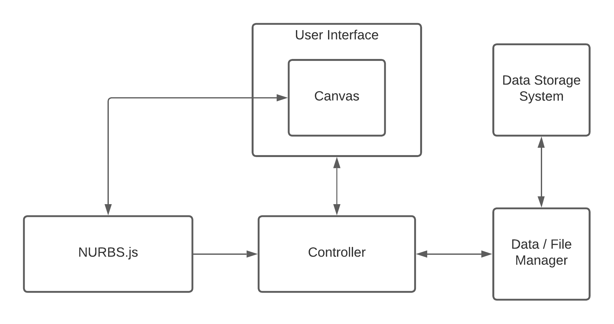
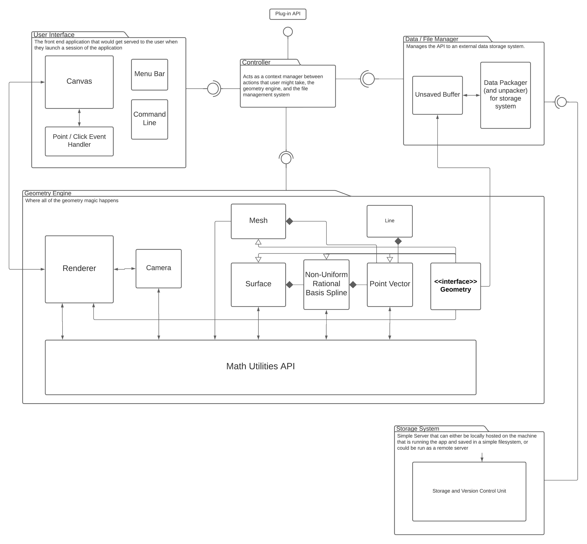

# NURBS.js

---

## What is NURBS.js?

NURBS.js is a JavaScript based geometry engine intended to be run in the browser, written in TypeScript.  This project is intended to initially be just a relatively efficient math library containing basic operations such as vector transformations and basic definitions of objects such as points, lines, splines, and surfaces. 

The spline definition will be based on a Non-Uniform-Rational-Basis-Spline (NURBS), which as the name of the project suggests, will be the core of the system that will allow us to build more complex and natural surfaces with better continuity. 

NURBS.js will be designed to act as a backend interface to abstract all of the nitty-gritty details behind the math that drives rendering a camera viewport to a canvas and building / storing complex geometry. There will be an API available to build your own front end on top of if you so choose. 

## Why?

---

"Why would someone try to take on building what is essentially a CAD software for the browser, when there are already so many to choose from?" you might ask. The answer to that question has a few facets, but the primary reason is that I believe there needs to be a CAD software that is fully open source. 

Currently, there are many CAD softwares on the market for a variety of customers. You have the AutoDesk suite for the architects and builders, you have Fusion 360 and Rhino for the makers, you have SolidWorks for the engineers, you have softwares like Maya and Cinema4D for the motion graphics and animation artists, etc. All of those examples fall into three categories. They are either already astronomically expensive to use, they require a subscription model, or in the near term will be going to a subscription service.

The primary notable exception to this is Blender, which is an excellent example of good open-source software, but targets a different market than I would like to address. The market I would like to address is the makers, simply because that is my background. 

While initially, I would like to target makers, it is my intention to carefully construct the base geometry engine such that others could feasibly and with relative ease, extend the system to build systems for other potential users such as animators, contractors, architects, machinists, engineers, etc. 

I fundamentally believe in open source software and want to contribute to lowering the barriers to entry for accessing the softwares required for learning many skills such as Industrial Design, Machining, Digital Art, etc. as I believe that is a critical component to making a more equitable and fair society. 

## Road Map

---

This project is currently in the research, planning, and feasibility stage. I am currently working on gathering all of the necessary knowledge for building the more technical parts of this system and mocking up the technical documentation required in communicating the general structure for the system.

It is my intention to loosely model NURBS.js after the CAD software Rhinoceros. There are a few reasons for this decision. First, it is because I have spent a lot of time in that software and it has formed a pattern for how I think about building in CAD. More importantly, it provides a level of freedom that allows the user to be more creative about how they go about designing something (for better or for worse for beginner users of Rhino). That level of freedom is what helped me get a much better handle on the Math behind the software for which I think is fundamental to learning how to use a CAD software effectively.

The basic structure of the application is a derivative of the Model-View-Controller design paradigm and will have 5 main components. 

1. User Interface - What the user interacts with on the webpage that is served to them
2. NURBS.js - The backend geometry and rendering engine that writes onto the canvas
3. A Data Storage System - Which will save and version control files in a Git-like way
4. A Data / File manager - Which allows us to connect to a Data Storage systems
5. Controller - The API that binds the other components together and would allow for plugin-like extensions





Each of these packages will have an API associated with them. A slightly more detailed view of their internal components can be found below.




As it stands, NURBS.js will be written in TypeScript, but will likely be required to port some of the more common core math operations, such as transformations, and projections to a WASM module of which I intend to write in Rust. 


## Getting Started

---

The package is currently in a prototype phase, where I am experimenting with structure and the math associated. 

This software is currently compiled using the typescript compiler and then made browser-ready by Browserify. I intend to move this to WebPack at some point during the prototyping phase.

### Compiling

If you have not done so already, install the node packages used in the system.

```bash
npm install
```

If you haven't done so already, you'll also have to add a build folder to the main folder.

```bash
mkdir build
```

Then you can simply use the compile.sh script in the main folder that will transpile our TypeScript to Javascript and then use browserify to package system to be served to the browser. 

```bash
./compile.sh
```

You can then run a local server to serve the index.html page to the browser.


### Extending the system

Currently, the project is in its prototype phase, but if you want to play with the system and the renderer that are currently built in, you can modify the index.ts file to draw new 2D shapes on the canvas. 

As we move forward, this functionality will get moved to a User Interface that will be served and you will be able to access the NURBS.js API via an in-window command line.

## License

---

```
MIT License

Copyright (c) 2022 Y-Naught Technologies

Permission is hereby granted, free of charge, to any person obtaining a copy
of this software and associated documentation files (the "Software"), to deal
in the Software without restriction, including without limitation the rights
to use, copy, modify, merge, publish, distribute, sublicense, and/or sell
copies of the Software, and to permit persons to whom the Software is
furnished to do so, subject to the following conditions:

The above copyright notice and this permission notice shall be included in all
copies or substantial portions of the Software.

THE SOFTWARE IS PROVIDED "AS IS", WITHOUT WARRANTY OF ANY KIND, EXPRESS OR
IMPLIED, INCLUDING BUT NOT LIMITED TO THE WARRANTIES OF MERCHANTABILITY,
FITNESS FOR A PARTICULAR PURPOSE AND NONINFRINGEMENT. IN NO EVENT SHALL THE
AUTHORS OR COPYRIGHT HOLDERS BE LIABLE FOR ANY CLAIM, DAMAGES OR OTHER
LIABILITY, WHETHER IN AN ACTION OF CONTRACT, TORT OR OTHERWISE, ARISING FROM,
OUT OF OR IN CONNECTION WITH THE SOFTWARE OR THE USE OR OTHER DEALINGS IN THE
SOFTWARE.
```


